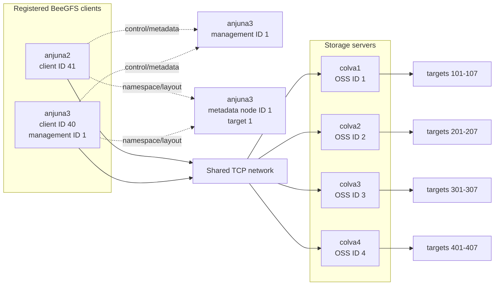

# Cluster topology

This document records the observed BeeGFS clients, services, storage servers,
targets, storage pools, mount layout, and network paths observed on 2026-09-21.
Detailed device mappings and collection sources are in the
[storage inventory](cluster-inventory/README.md).

## Current map

The diagram shows service relationships, not physical switch wiring.

Advertised interfaces and selected routes from `anjuna3` were TCP. All four
storage hosts reported 2.5-Gb/s full-duplex links.

## Service inventory

| Host | BeeGFS role | Node details | Observation date |
|---|---|---|---|
| `anjuna2` | Client | Client ID 41; `eno1` and other interfaces advertised as TCP | Verified 2026-09-21 |
| `anjuna3` | Client, management, and metadata | Client ID 40; management ID 1; metadata node ID 1; metadata target/root 1 | Verified 2026-09-21 |
| `colva1` | Storage | Storage ID 1; targets 101-107; `enp7s0` advertised as TCP | Verified 2026-09-21 |
| `colva2` | Storage | Storage ID 2; targets 201-207; `enp7s0` advertised as TCP | Verified 2026-09-21 |
| `colva3` | Storage | Storage ID 3; targets 301-307; `enp7s0` advertised as TCP | Verified 2026-09-21 |
| `colva4` | Storage | Storage ID 4; targets 401-407; `enp7s0` advertised as TCP | Verified 2026-09-21 |

The `beegfs-mgmtd` and `beegfs-meta` services were both active on `anjuna3` at the
collection time.

### Target state and media

All 28 targets were `Online` with `Good` consistency. `beegfs-df` reported all
targets in its `normal` capacity pool; this capacity-pool label is distinct from
BeeGFS user-defined storage pools.

| OSS | HDD targets (approximately 1.86 TiB) | NVMe targets (approximately 0.93 TiB) | State |
|---|---|---|---|
| `colva1` | 101, 102, 103 | 104, 105, 106, 107 | Online/Good |
| `colva2` | 201, 202, 203, 204 | 205, 206, 207 | Online/Good |
| `colva3` | 301, 302, 303, 304 | 305, 306, 307 | Online/Good |
| `colva4` | 401, 402, 403 | 404, 405, 406, 407 | Online/Good |

Numeric target-to-device bindings are recorded for all four storage nodes.

At collection time, the metadata target reported 913.3 GiB total and 90.7 GiB
free. Target 307 was 61% free; the remaining storage targets were 78-100% free.
These values are a time-specific state rather than permanent topology.

### User-defined storage pools

| Pool ID | Description | Targets | Notes |
|---|---|---|---|
| 1 | `Default` | 401-407 | All seven targets are Online/Good |
| 2 | `hdd_EMPTY_merged_into_3` | None | Empty historical pool |
| 3 | `hdd` | 101-103, 201-204, 301-304 | 11 targets |
| 4 | `offline_pool` | 207 | Target 207 is Online/Good; the pool name does not describe current health |
| 5 | `pfs_test` | None | Empty |
| 6 | `ssd` | 104-107, 205-206, 305-307 | 9 targets |

Storage-pool membership is placement configuration, not physical-device proof.
In particular, target 207 is approximately 0.93 TiB but is not currently in the
`ssd` pool, and the `colva4` targets have not been classified outside `Default`.

### Client mount

`anjuna3` mounts `beegfs_nodev` at `/mnt/beegfs` as BeeGFS. The repository's
historical default paths `/mnt/beegfs/advay`, `/mnt/beegfs/advay/hdd`, and
`/mnt/beegfs/advay/ssd` do not exist in the observed namespace.

`/mnt/beegfs/pfs` is a directory with entry ID `0-69986D7A-1`. Its metadata is on
metadata node 1 (`anjuna3`). Its inherited stripe pattern is RAID0 with a 512-KiB
chunk size, four desired storage targets, and storage pool 1 (`Default`). This is
a directory pattern; it does not establish the actual placement of existing files.

### `anjuna3` networking

The BeeGFS client configuration names `anjuna3` as the management host, enables
RDMA with TCP fallback, uses buffered file caching, and enables remote `fsync`.
No interface restriction files are configured. No RDMA links were reported by
`rdma link show`, and the registered interfaces were advertised as TCP, so RDMA
is configured but unavailable on this host in the collected state.

`enp4s0` is up with addresses `192.168.0.7/24` and `10.1.19.74/24`; both networks
have routes on that interface. `wlo1` and multiple virtual/container interfaces
are also up.

From the `anjuna3` client, BeeGFS selected these TCP routes:

| Service/node | Selected route |
|---|---|
| Management `anjuna3:8008` | `192.168.0.7:8008` |
| Metadata `anjuna3:8005` | `192.168.0.7:8005` |
| Storage `colva1:8003` | `192.168.0.2:8003` via `enp7s0` |
| Storage `colva2:8003` | `10.1.19.76:8003` via `enp7s0` |
| Storage `colva3:8003` | `10.1.19.77:8003` via `enp7s0` |
| Storage `colva4:8003` | `192.168.0.5:8003` via `enp7s0` |

`colva2` and `colva3` also advertise `192.168.0.3` and `192.168.0.4`,
respectively. The BeeGFS client selected their `10.1.19.0/24` addresses in this
state. `colva1` and `colva4` advertised only their `192.168.0.0/24` addresses.

## Storage-node physical topology

All observed target filesystems are XFS. No storage node reported an active MD
array. The only LVM devices in these captures belong to operating-system volumes,
not BeeGFS targets.

On every node, the SATA disks share the Intel controller at PCI `00:17.0`.
Each NVMe disk appears behind a separate controller endpoint at PCI `02:00.0`,
`03:00.0`, `05:00.0`, or `08:00.0`. All four storage nodes reported a 2,500-Mb/s
full-duplex `enp7s0` link and no RDMA links. `colva2` and `colva3` have both
`192.168.0.0/24` and `10.1.19.0/24` addresses; `colva1` and `colva4` have only
the observed `192.168.0.0/24` address.

### Inventory sources

The common command block is recorded in
[storage inventory](cluster-inventory/README.md). Summarized command
output is preserved for [`colva1`](../results/cluster-inventory/20260921/colva1.txt),
[`colva2`](../results/cluster-inventory/20260921/colva2.txt),
[`colva3`](../results/cluster-inventory/20260921/colva3.txt), and
[`colva4`](../results/cluster-inventory/20260921/colva4.txt).

Missing: exact drive models for `colva2`–`colva4` and upstream PCIe/switch
topology.
